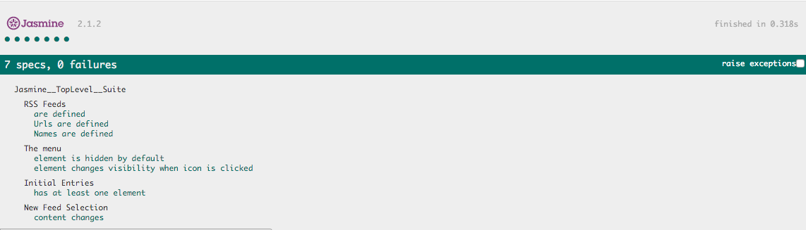

# Project Overview

In this project you are given a web-based application that reads RSS feeds. The original developer of this application clearly saw the value in testing, they've already included [Jasmine](http://jasmine.github.io/) and even started writing their first test suite! Unfortunately, they decided to move on to start their own company and we're now left with an application with an incomplete test suite. That's where you come in.

# What I Have Done.
Utilize Jasmine to write test cases toward a web app, and to ensure the functionality of the application.

1. Write a test that loops through each feed in the allFeeds object and ensures it has a URL defined and that the URL is not empty.
2. Write a test that loops through each feed in the allFeeds object and ensures it has a name defined and that the name is not empty.
3. Write a new test suite named "The menu".
4. Write a test that ensures the menu element is hidden by default. You'll have to analyze the HTML and the CSS to determine how we're performing the hiding/showing of the menu element.
5. Write a test that ensures the menu changes visibility when the menu icon is clicked. This test should have two expectations: does the menu display when clicked and does it hide when clicked again.
6. Write a test that ensures when the loadFeed function is called and completes its work, there is at least a single .entry element within the .feed container. Remember, loadFeed() is asynchronous so this test wil require the use of Jasmine's beforeEach and asynchronous done() function.
7. Write a test that ensures when a new feed is loaded by the loadFeed function that the content actually changes. Remember, loadFeed() is asynchronous.

# Instruction:
- Clone this repo to your local machine.
- Run index.html, you will find test results about this project.

# Result

